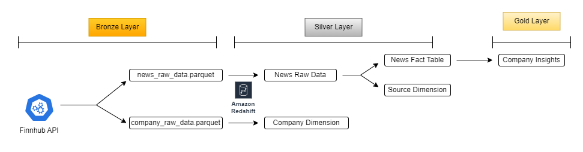
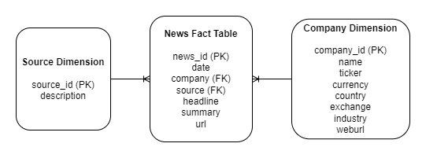
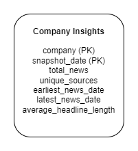

# Stocks News ETL

## Overview

This project is an ETL pipeline that extracts, transforms, and loads (ETL) stock-related news data from the Finnhub API into a data warehouse hosted on Amazon Redshift. The pipeline is divided into three layers: Bronze, Silver, and Gold. The process is automated using Docker, Apache Airflow, and Python, making it efficient and scalable.

### Project Structure

The repository is organized as follows:

- `bronze/`: Contains scripts for data extraction from the Finnhub API.
- `silver/`: Contains scripts for transforming the extracted data and loading it into Amazon Redshift.
- `gold/`: Contains scripts for generating company-level news insights for analysis.
- `dags/`: Apache Airflow DAG definitions for orchestrating the ETL process.
- `config/`: Airflow configuration files.
- `logs/`: Log files generated by the ETL process.
- `plugins/`: Custom Airflow plugins.
- `tasks/`: Individual tasks for the ETL process.
- `tests/`: Test scripts for validating different functionalities.
- `utils/`: Utility functions shared across different layers.

### ETL Process

1. **Diagram**   
    

1. **Data Warehouse**   
    

1. **Company Insights**   
    

### Layers

1. **Bronze Layer**:
    - Extracts data from the Finnhub API for:
        - Daily news articles related to one or more companies (provided by the user as a list of stock tickers).
        - Company information associated with those stock tickers.
    - Output: Two Parquet files are created (`news_raw_dataYYYY_MM_DD.parquet` and `company_raw_dataYYYY_MM_DD.parquet`)

    The main Python scripts in this layer are:
    - `API_company_extraction.py`: Extracts company details from the API.
    - `API_news_extraction.py`: Extracts news articles from the API.
    - `API_parquet_creation.py`: Saves the raw data to Parquet format.

2. **Silver Layer**: Data Transformation and Loading

    - This layer transforms the raw data from the Bronze Layer into structured formats and loads them into Amazon Redshift. The transformation process includes normalization, cleaning, and creating relationships between tables to prepare the data for querying.
    
    The following scripts handle this process:
    
    - **`db_creation.py`**: This script creates the necessary tables in Redshift:
        - **news_raw_data**: Contains raw data for each news article.
        - **company_dimension**: Contains information about the companies mentioned in the articles.
        - **source_dimension**: Contains metadata about the news sources.
        - **news_fact_table**: Contains detailed information on each news article, including FKs from company_dimension and source_dimension.
        - **company_insights**: Contains company-level news insights for analysis.

    - **`db_data_insertion.py`**: This script handles inserting the transformed data into the Redshift tables:
        - Loads news articles into the **news_raw_data**.
        - Loads company information into the **company_dimension**.
        
    - **`db_transformation.py`**: This script performs data cleaning, normalization, and linking (foreign key relationships) between the fact and dimension tables. The transformed data is then ready for analysis.
        - Loads source information into the **source_dimension** table.
        - Loads news curated data into the **news_fact_table** table.


    
3. **Gold Layer**: Generating Insights
    - In this layer, the pipeline calculates key metrics and insights for each company based on the news articles. The results are stored in the **company_insights** table, which includes metrics that allow users to analyze news coverage trends over time.

### Docker and Airflow Automation

The entire ETL process is automated using Docker and Apache Airflow:
- The pipeline is defined as an Airflow DAG, which orchestrates the data extraction, transformation, and loading steps.
- A Docker image is built with all the necessary dependencies to run the ETL process seamlessly.

### Requirements

The project uses the following technologies and tools:
- Python
- Apache Airflow
- Docker
- Amazon Redshift
- Finnhub API

### How to Run

To run the project, follow these steps:

1. **Clone the repository**:
   ```bash
   git clone https://github.com/nicovinolo/stocks-news-ETL.git
   cd stocks-news-ETL
    ```
2. **Create .env file**:
   ```
   AIRFLOW_UID=50000  #This parameter is always 50000.

   API_KEY = api_key
   REDSHIFT_HOST = redshift_host
   REDSHIFT_PORT = redshift_port
   REDSHIFT_DBNAME = redshift_dbname
   REDSHIFT_USER = redshift_user
   REDSHIFT_PASSWORD = redshift_password
   REDSHIFT_SCHEMA = redshift_schema
    ```
3. **Run Makefile**:
   ``` bash
   make all
    ```
4. **Access Airflow**:
     Open the Airflow UI at http://localhost:8080 and see the DAG status. Both username and password are airflow. 

5. **Go to Amazon Redshift and see the results**:
    Open the database (in DBeaver for example) using the same credentials as the .env file and see if the tables were populated correctly.

### Tests

The project includes a set of tests to ensure the data extraction and transformation processes work correctly, as well as code linting for quality assurance. The tests are located in the `tests/` directory and are as follows:

1. **API_test_data_type.py**:
   - This test checks that the data types of the extracted API data match the expected schema. This ensures that the data coming from the API has consistent types for all fields.

2. **API_test_row_count.py**:
   - This test verifies that the number of rows extracted from the API is within expected bounds. This ensures that the API returns a sufficient amount of data and there are no missing records.

3. **linting.py**:
   - This script runs code linting checks to ensure that the code follows PEP8 style guidelines. It works in conjunction with a GitHub Action to automatically lint the code on each push or pull request to the repository.

The linting process is automated with GitHub Actions, ensuring continuous code quality. Each time you push new code or create a pull request, the GitHub Action will run the linter and provide feedback in the repository.